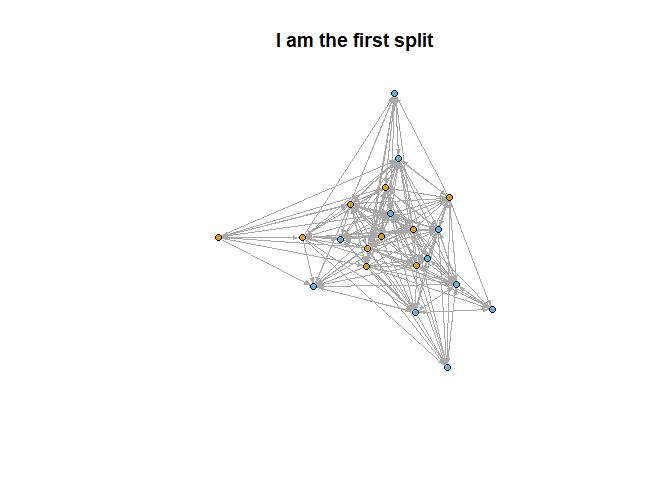
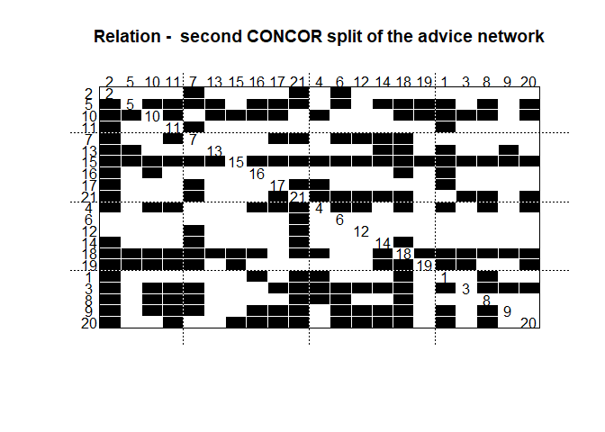

## Setup

Load in the required functions and data, igraph is required but is loaded when sourcing CONCOR.R. For this example we will use the Krackhardt high-tech managers data.


```r
load("HighTech.Rdata")
source('CONCOR.R')
source('CONCOR_supplemental_fun.R')
```


## Running CONCOR

Create the adjacency matrixes from each igraph object of interest.


```r
m0=get.adjacency(gadvice, sparse = FALSE)
m1=get.adjacency(gfriend, sparse = FALSE)
m2=get.adjacency(greport, sparse = FALSE)
```

Store the adacency matrixes denoting all relationships of interest within a single list. Fora single relationship simply put it in a list of length 1. If multple relationships are used the matrixies MUST be of the same size.


```r
m.list1=list(m0)
m.list2=list(m0,m1)
m.list3=list(m0,m1,m2)
```

Once stored within a list CONCOR can be run. It will split the matrix and continue to split each subsequent, smaller matrix until the specified number of splits are made. If the specified number of splits would cause structurally equivalent nodes to be split, or a single node to be split, the CONCOR algorithm will fail. In addition, the current version seperates all isolated nodes into their own block before running concor.

The output from concor is matrix with the first coumn being the block membership and the second being the node's name. The row names are simply the arbitrary order they are returned in.


### Example

Shown below are all possible splits of the gadvice data from the Krackhardt high-tech managers data and the first failing split. The output from the 2nd and 4th (last possible) splits are displayed.


```r
C1.1=concor(m.list1, p=1)
C1.2=concor(m.list1, p=2)
C1.3=concor(m.list1, p=3)
C1.4=concor(m.list1, p=4)
#C1.5=concor(m.list1, p=5)
```

The second split


```r
C1.2
```

```
##    block vertex
## 1      1    v10
## 2      1    v13
## 3      1    v18
## 4      1    v19
## 5      2     v3
## 6      2     v4
## 7      2     v5
## 8      2     v9
## 9      2    v15
## 10     2    v20
## 11     3     v2
## 12     3     v6
## 13     3     v7
## 14     3    v12
## 15     3    v14
## 16     3    v21
## 17     4     v1
## 18     4     v8
## 19     4    v11
## 20     4    v16
## 21     4    v17
```

The fourth split


```r
C1.4
```

```
##    block vertex
## 1      1    v19
## 2      2    v13
## 3      3    v18
## 4      4    v10
## 5      5     v9
## 6      6     v4
## 7      6    v20
## 8      7     v5
## 9      8    v15
## 10     8     v3
## 11     9    v21
## 12    10     v7
## 13    11     v6
## 14    11    v12
## 15    12     v2
## 16    12    v14
## 17    13    v11
## 18    13    v17
## 19    14     v8
## 20    15    v16
## 21    16     v1
```

It can be seen that in the fourth split multiple nodes have become isolated in their own blockings, so further splits will in turn fail.

## For Multiple Relationships

When multiple realationships are to be considerd the adjacency matrixies must be put into a single list. This was done above when I showed some of the possible lists. For this I will use `m.list2=list(m0,m1)` comprised of the advice and friendship relationships.

Once listed together running CONCOR for multiple relations is identical to a single relation.


```r
C2.1=concor(m.list2, p=1)
C2.2=concor(m.list2, p=2)
C2.3=concor(m.list2, p=3)
C2.4=concor(m.list2, p=4)
#C2.5=concor(m.list2, p=5)
```

The output for the second split is shown below.


```r
C2.2
```

```
##    block vertex
## 1      1    v10
## 2      1    v13
## 3      1    v18
## 4      1    v19
## 5      2     v3
## 6      2     v4
## 7      2     v5
## 8      2     v9
## 9      2    v15
## 10     2    v20
## 11     3     v2
## 12     3     v6
## 13     3     v7
## 14     3    v14
## 15     3    v21
## 16     4     v1
## 17     4     v8
## 18     4    v11
## 19     4    v12
## 20     4    v16
## 21     4    v17
```

## Using the CONCOR Outputs

Once CONCOR has been run and block membership is determined, there are a near unending number of things one can do to understand and represent the data. Two of the simplest ways are plotting the network with color representing block membership and blockmodeling. Functions to do both are included in the file `CONCOR_supplemental_fun.R`.

To start either the CONCOR splits must be added as vertex attributes. This can be done using the function `blk.apply` from `CONCOR_supplemental_fun.R`. The inputs of this function are the igraph object you created the splits from, the split, and a name to give the new vertex attribute. This is shown below for all four splits for the advice nework from the Krackhardt high-tech managers data.


```r
gadvice=blk.apply(gadvice, C1.1, "split1")
gadvice=blk.apply(gadvice, C1.2, "split2")
gadvice=blk.apply(gadvice, C1.3, "split3")
gadvice=blk.apply(gadvice, C1.4, "split4")

gadvice
```

```
## IGRAPH 513bbbc DNW- 21 190 -- 
## + attr: id (v/c), name (v/c), x (v/n), y (v/n), Age (v/n), Tenure
## | (v/n), Level (v/n), Department (v/n), split1 (v/n), split2
## | (v/n), split3 (v/n), split4 (v/n), weight (e/n)
## + edges from 513bbbc (vertex names):
##  [1] v1->v2  v1->v4  v1->v8  v1->v16 v1->v18 v1->v21 v2->v6  v2->v7 
##  [9] v2->v21 v3->v1  v3->v2  v3->v4  v3->v6  v3->v7  v3->v8  v3->v9 
## [17] v3->v10 v3->v11 v3->v12 v3->v14 v3->v17 v3->v18 v3->v20 v3->v21
## [25] v4->v1  v4->v2  v4->v6  v4->v8  v4->v10 v4->v11 v4->v12 v4->v16
## [33] v4->v17 v4->v18 v4->v20 v4->v21 v5->v1  v5->v2  v5->v6  v5->v7 
## [41] v5->v8  v5->v10 v5->v11 v5->v13 v5->v14 v5->v16 v5->v17 v5->v18
## + ... omitted several edges
```

### PLotting the network

To plot the network with block memebership represented by a colour, the function `concor.plot` can be used from `CONCOR_supplemental_fun.R` simmply because it is easier than saying `plot(iobject, vertex.color=vertex.attributes(iobject)[[split.name]], vertex.label=NA, vertex.size= 5,edge.arrow.size=.3, main=tital)` every time you want to plot one of your networks. Although in all likelihood this function will need to be tweaked for individual use simply becuse you want your nodes to be a diffrent size or to use another colour scheme. The inputs for this function are the igraph object, the name of the split you want to represent, and a title.

The function is used below to plot the first and second splits of the advice network.


```r
concor.plot(gadvice, "split1", "I am the first CONCOR split for the advice nework")
```

<!-- -->

```r
concor.plot(gadvice, "split2", "And I am the second")
```

<!-- -->

### Blockmodeling

Blockmodeling is something that is built into the library `statnet`, or more specifically its dependent package `SNA`. For the purposes of creating blockmodels based off the CONCOR outputs, a function that uses `statnet` was created called `make.blokmodel.stuff` in `CONCOR_supplemental_fun.R`. This function does a bit more than create a blockmodel, if its name was not telling enough. In fact it creates the blockmodel as created by 'statnet' but also produces igraph objects representing the reduced graph of the overall network.

The inputs for this function are simply the igraph object representing your network and the name of the concor split as it has been saved in the object. This is ran below for the first and second splits for the advice network, the output for the first split is also shown.


```r
bl1=make.blokmodel.stuff(gadvice, "split1")
bl2=make.blokmodel.stuff(gadvice, "split2")
bl1
```

```
## [[1]]
## 
## Network Blockmodel:
## 
## Block membership:
## 
##  1  2  3  4  5  6  7  8  9 10 11 12 13 14 15 16 17 18 19 20 21 
##  2  1  2  2  1  2  1  2  2  1  1  2  1  2  1  1  1  2  2  2  1 
## 
## Reduced form blockmodel:
## 
## 	 1 2 3 4 5 6 7 8 9 10 11 12 13 14 15 16 17 18 19 20 21 
##           Block 1   Block 2
## Block 1 0.4666667 0.4272727
## Block 2 0.4909091 0.4272727
## 
## [[2]]
## IGRAPH a88c999 DN-- 2 2 -- 
## + attr: name (v/c)
## + edges from a88c999 (vertex names):
## [1] Block 1->Block 1 Block 2->Block 1
## 
## [[3]]
## IGRAPH a88cc08 DNW- 2 2 -- 
## + attr: name (v/c), weight (e/n)
## + edges from a88cc08 (vertex names):
## [1] Block 1->Block 1 Block 2->Block 1
## 
## [[4]]
## [1] 0.452381
```

Outputed from this function is a list. The first list element is the blockmodel object as `statnet` outputs it. The second element is an igraph object representing the reduced graph of the network based off the blockmodel, this output has unweighted connection values. The connections were determined to be existent if the density of a block was greater than the overall density of the network and zero if less. The third output is an igraph object representing the same reduced graph but the connections were kept weighted based of the density of the blocks. The final part of the output list is the density used as a cutoff for both reduced graphs.

#### Ploting the blockmodel

Ploting the blockmodel itself is as simple as just running the plot function on it due to it being built into the `SNA` package. Sadly customization options are limited. If the listing the node numbers bothers you (if you have a large nework they will) running `bl2[[1]]$plabels = rep("",length(bl2[[1]]$plabels))` where `bl2[[1]]` is the first ouput of `make.blokmodel.stuff` for your network.

The simple plotting of the blockmodel is shown below for the second split. It was titled by using `bl2[[1]]$glabels = "title"` despite not having an option to.


```r
bl2[[1]]$glabels = "second CONCOR split of the advice network" 
plot(bl2[[1]])
```

<!-- -->

Due to the high density of the connections in this network it is very hard to tell what is going on just from the blockmodel. To actually see how these blocks relate to each other it is much easier to look at the reduced graph.

#### Plotting the Reduced Graphs

To plot the reduced graphs of the network the second and third ouputs from `make.blokmodel.stuff` are used. The second (non weighted) should be used if you don't care about the relative strength of the connections between blocks as long as they are stronger than the average density of the whole network. The second should be used if the relative strengths do matter to you.

For the unweighted reduced graph use the `reduced.plot` function (or just write your own depending on what you want it to do). This function plots the directed reduced graph with each separate block as a sperate colour. The color will corespond to that of the blocks in the whole network if the `concor.plot` function is used. The output for the advice network's second split is shown below.

```r
reduced.plot(bl2)
```

<!-- -->

If the relative weight of the ties matter to you then the third output from `make.blokmodel.stuff` and the plot function `weighted.reduced.plot` should be used. This function works the same as `reduced.plot` but sizes the links are dependent on the weight of those ties. An example of this for the second split of the advice network is shown below.


```r
weighted.reduced.plot(bl2)
```

<!-- -->

For this network very little is visually gained from keeping the ties weighted except that the connections seem pretty evenly weighted.


