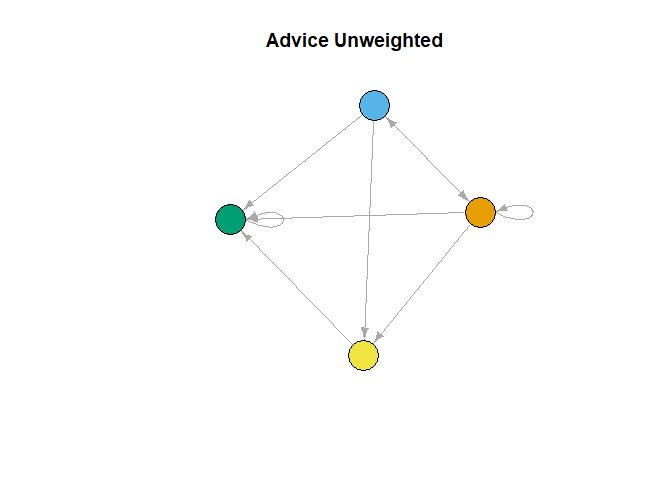
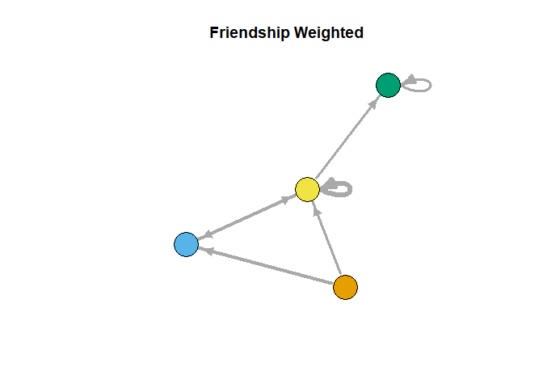

## Setup

Load in the required functions and data, igraph is required but is loaded when sourcing CONCOR.R. For this example we will use the Krackhardt high-tech managers data.


```r
load("HighTech.Rdata")
library(igraph)
source('CONCOR.R')
source('CONCOR_supplemental_fun.R')
source('CONCOR_blockmodeling.R')
```


## Running CONCOR

Create the adjacency matrices from each igraph object of interest.


```r
m0=get.adjacency(gadvice, sparse = FALSE)
m1=get.adjacency(gfriend, sparse = FALSE)
m2=get.adjacency(greport, sparse = FALSE)
```

Store the adjacency matrices denoting all relationships of interest within a single list. Fora single relationship simply put it in a list of length 1. If multiple relationships are used the matrices MUST be of the same size.


```r
m.list1=list(m0)
m.list2=list(m0,m1)
m.list3=list(m0,m1,m2)
```

To check that both node names and adjacency matrix sizes, agree in addition to checking that node names exist (and adding them if they don't) the `concor.validitycheck` function can be used. Below it can be seen that with valid input no warnings are thrown, and this works even for a singular relation (where it simply checks that node names exist).

```r
m.list1=concor.validitycheck(m.list1)
m.list2=concor.validitycheck(m.list2)
m.list3=concor.validitycheck(m.list3)
```
Now if there is something wrong with the inputs it starts to vigorously wave red flags at you, as shown below.


```r
m1=matrix(c(1,2,3,4),2)
colnames(m1)=c("n","m")
rownames(m1)=c("n","m")
m2=matrix(c(5,6,7,8),2)

#concor.validitycheck(list(m1, m2)) fails and gives error: "Node name mismatch" due to m2 not having names but m1 having them
concor.validitycheck(list(m2, m2)) #adds node names but warns you that it did
```

```
## Warning in concor.validitycheck(list(m2, m2)): node names don't exist
## Adding default node names
```

```
## [[1]]
##      v001 v002
## v001    5    7
## v002    6    8
## 
## [[2]]
##      v001 v002
## v001    5    7
## v002    6    8
```

```r
#concor.validitycheck(list(m1, m0)) gives error: "Adgacency matrixes of mixmatched sizes" due to matrixies of differing sizes being inputed
```


Once the adjacency matrices are stored within a list and they are confirmed to be valid inputs, CONCOR can be run. It will split the matrix and continue to split each subsequent, smaller matrix until the specified number of splits are made. If the specified number of splits would cause structurally equivalent nodes to be split, or a single node to be split, the CONCOR algorithm will fail. In addition, the current version separates all isolated nodes into their own block before running concor.

The output from concor is matrix with the first column being the block membership and the second being the node's name. The row names are simply the arbitrary order they are returned in.


### Example

Shown below are all possible splits of the gadvice data from the Krackhardt high-tech managers data and the first failing split. The output from the 2nd and 4th (last possible) splits are displayed.


```r
C1.1=concor(m.list1, p=1)
C1.2=concor(m.list1, p=2)
C1.3=concor(m.list1, p=3)
C1.4=concor(m.list1, p=4)
#C1.5=concor(m.list1, p=5)
```

The second split


```r
C1.2
```

```
##    block vertex
## 1      1    v10
## 2      1    v13
## 3      1    v18
## 4      1    v19
## 5      2     v3
## 6      2     v4
## 7      2     v5
## 8      2     v9
## 9      2    v15
## 10     2    v20
## 11     3     v2
## 12     3     v6
## 13     3     v7
## 14     3    v12
## 15     3    v14
## 16     3    v21
## 17     4     v1
## 18     4     v8
## 19     4    v11
## 20     4    v16
## 21     4    v17
```

The fourth split


```r
C1.4
```

```
##    block vertex
## 1      1    v19
## 2      2    v13
## 3      3    v18
## 4      4    v10
## 5      5     v9
## 6      6     v4
## 7      6    v20
## 8      7     v5
## 9      8    v15
## 10     8     v3
## 11     9    v21
## 12    10     v7
## 13    11     v6
## 14    11    v12
## 15    12     v2
## 16    12    v14
## 17    13    v11
## 18    13    v17
## 19    14     v8
## 20    15    v16
## 21    16     v1
```

It can be seen that in the fourth split multiple nodes have become isolated in their own blockings, so further splits will in turn fail.

## For Multiple Relationships

When multiple relationships are to be considered the adjacency matrices must be put into a single list. This was done above when I showed some of the possible lists. For this I will use `m.list2=list(m0,m1)` comprised of the advice and friendship relationships.

Once listed together running CONCOR for multiple relations is identical to a single relation.


```r
C2.1=concor(m.list2, p=1)
C2.2=concor(m.list2, p=2)
C2.3=concor(m.list2, p=3)
C2.4=concor(m.list2, p=4)
#C2.5=concor(m.list2, p=5)
```

The output for the second split is shown below.


```r
C2.2
```

```
##    block vertex
## 1      1    v10
## 2      1    v13
## 3      1    v18
## 4      1    v19
## 5      2     v3
## 6      2     v4
## 7      2     v5
## 8      2     v9
## 9      2    v15
## 10     2    v20
## 11     3     v2
## 12     3     v6
## 13     3     v7
## 14     3    v14
## 15     3    v21
## 16     4     v1
## 17     4     v8
## 18     4    v11
## 19     4    v12
## 20     4    v16
## 21     4    v17
```

## Using the CONCOR Outputs

Once CONCOR has been run and block membership is determined, there are a near unending number of things one can do to understand and represent the data. Two of the simplest ways are plotting the network with color representing block membership and blockmodeling. Functions to do both are included in the file `CONCOR_supplemental_fun.R`.

To start either the CONCOR splits must be added as vertex attributes. This can be done using the function `blk.apply` if the CONCOR outputs have been previously saved or by simply using the `make.igraph` function that will run CONCOR and apply the outputs as the vertex attribute `csplitn` where n is the split specified. Both functions are located in the `CONCOR_supplemental_fun.R` file. 

The inputs of `blk.apply` are the igraph object you created the splits from, the split, and a name to give the new vertex attribute. This is shown below for all four splits for the advice network from the Krackhardt high-tech managers data.


```r
gadvice=blk.apply(gadvice, C1.1, "split1")
gadvice=blk.apply(gadvice, C1.2, "split2")
gadvice=blk.apply(gadvice, C1.3, "split3")
gadvice=blk.apply(gadvice, C1.4, "split4")

gadvice
```

```
## IGRAPH 513bbbc DNW- 21 190 -- 
## + attr: id (v/c), name (v/c), x (v/n), y (v/n), Age (v/n), Tenure
## | (v/n), Level (v/n), Department (v/n), split1 (v/n), split2
## | (v/n), split3 (v/n), split4 (v/n), weight (e/n)
## + edges from 513bbbc (vertex names):
##  [1] v1->v2  v1->v4  v1->v8  v1->v16 v1->v18 v1->v21 v2->v6  v2->v7 
##  [9] v2->v21 v3->v1  v3->v2  v3->v4  v3->v6  v3->v7  v3->v8  v3->v9 
## [17] v3->v10 v3->v11 v3->v12 v3->v14 v3->v17 v3->v18 v3->v20 v3->v21
## [25] v4->v1  v4->v2  v4->v6  v4->v8  v4->v10 v4->v11 v4->v12 v4->v16
## [33] v4->v17 v4->v18 v4->v20 v4->v21 v5->v1  v5->v2  v5->v6  v5->v7 
## [41] v5->v8  v5->v10 v5->v11 v5->v13 v5->v14 v5->v16 v5->v17 v5->v18
## + ... omitted several edges
```

The same can simply be be done without first running CONCOR by using `make.igraph` function on the list of adjacency matrices you are interested in and the split number you want, as shown below for the second split. This has the advantage of returning the split added to igraph objects for each relationship.


```r
make.igraph(m.list2, 2)
```

```
## [[1]]
## IGRAPH edf1b1a DN-- 21 190 -- 
## + attr: name (v/c), csplit2 (v/n)
## + edges from edf1b1a (vertex names):
##  [1] v1->v2  v1->v4  v1->v8  v1->v16 v1->v18 v1->v21 v2->v6  v2->v7 
##  [9] v2->v21 v3->v1  v3->v2  v3->v4  v3->v6  v3->v7  v3->v8  v3->v9 
## [17] v3->v10 v3->v11 v3->v12 v3->v14 v3->v17 v3->v18 v3->v20 v3->v21
## [25] v4->v1  v4->v2  v4->v6  v4->v8  v4->v10 v4->v11 v4->v12 v4->v16
## [33] v4->v17 v4->v18 v4->v20 v4->v21 v5->v1  v5->v2  v5->v6  v5->v7 
## [41] v5->v8  v5->v10 v5->v11 v5->v13 v5->v14 v5->v16 v5->v17 v5->v18
## [49] v5->v19 v5->v20 v5->v21 v6->v21 v7->v2  v7->v6  v7->v11 v7->v12
## [57] v7->v14 v7->v17 v7->v18 v7->v21 v8->v2  v8->v4  v8->v6  v8->v7 
## + ... omitted several edges
## 
## [[2]]
## IGRAPH edf1b1a DN-- 21 102 -- 
## + attr: name (v/c), csplit2 (v/n)
## + edges from edf1b1a (vertex names):
##  [1] v1 ->v2  v1 ->v4  v1 ->v8  v1 ->v12 v1 ->v16 v2 ->v1  v2 ->v18
##  [8] v2 ->v21 v3 ->v14 v3 ->v19 v4 ->v1  v4 ->v2  v4 ->v8  v4 ->v12
## [15] v4 ->v16 v4 ->v17 v5 ->v2  v5 ->v9  v5 ->v11 v5 ->v14 v5 ->v17
## [22] v5 ->v19 v5 ->v21 v6 ->v2  v6 ->v7  v6 ->v9  v6 ->v12 v6 ->v17
## [29] v6 ->v21 v8 ->v4  v10->v3  v10->v5  v10->v8  v10->v9  v10->v12
## [36] v10->v16 v10->v20 v11->v1  v11->v2  v11->v3  v11->v4  v11->v5 
## [43] v11->v8  v11->v9  v11->v12 v11->v13 v11->v15 v11->v17 v11->v18
## [50] v11->v19 v12->v1  v12->v4  v12->v17 v12->v21 v13->v5  v13->v11
## + ... omitted several edges
```
While a third option and probably the most useful for this situation, of having igraph objects to start, is to run `concor.igraph.apply` on the list of igraph objects of interest. This does the same thing as `make.igraph` but the input list is of igraph objects not the adjacency matrices.


```r
inp=list(gadvice, gfriend)
#add first and second splits
adv.freind.igraph=concor.igraph.apply(inp, 1)
adv.freind.igraph=concor.igraph.apply(adv.freind.igraph, 2)
adv.freind.igraph
```

```
## [[1]]
## IGRAPH 513bbbc DNW- 21 190 -- 
## + attr: id (v/c), name (v/c), x (v/n), y (v/n), Age (v/n), Tenure
## | (v/n), Level (v/n), Department (v/n), split1 (v/n), split2
## | (v/n), split3 (v/n), split4 (v/n), csplit1 (v/n), csplit2 (v/n),
## | weight (e/n)
## + edges from 513bbbc (vertex names):
##  [1] v1->v2  v1->v4  v1->v8  v1->v16 v1->v18 v1->v21 v2->v6  v2->v7 
##  [9] v2->v21 v3->v1  v3->v2  v3->v4  v3->v6  v3->v7  v3->v8  v3->v9 
## [17] v3->v10 v3->v11 v3->v12 v3->v14 v3->v17 v3->v18 v3->v20 v3->v21
## [25] v4->v1  v4->v2  v4->v6  v4->v8  v4->v10 v4->v11 v4->v12 v4->v16
## [33] v4->v17 v4->v18 v4->v20 v4->v21 v5->v1  v5->v2  v5->v6  v5->v7 
## + ... omitted several edges
## 
## [[2]]
## IGRAPH 78ba0f1 DNW- 21 102 -- 
## + attr: id (v/c), name (v/c), x (v/n), y (v/n), Age (v/n), Tenure
## | (v/n), Level (v/n), Department (v/n), csplit1 (v/n), csplit2
## | (v/n), weight (e/n)
## + edges from 78ba0f1 (vertex names):
##  [1] v1 ->v2  v1 ->v4  v1 ->v8  v1 ->v12 v1 ->v16 v2 ->v1  v2 ->v18
##  [8] v2 ->v21 v3 ->v14 v3 ->v19 v4 ->v1  v4 ->v2  v4 ->v8  v4 ->v12
## [15] v4 ->v16 v4 ->v17 v5 ->v2  v5 ->v9  v5 ->v11 v5 ->v14 v5 ->v17
## [22] v5 ->v19 v5 ->v21 v6 ->v2  v6 ->v7  v6 ->v9  v6 ->v12 v6 ->v17
## [29] v6 ->v21 v8 ->v4  v10->v3  v10->v5  v10->v8  v10->v9  v10->v12
## [36] v10->v16 v10->v20 v11->v1  v11->v2  v11->v3  v11->v4  v11->v5 
## + ... omitted several edges
```
The main reason to use this method is that any existing vertex attributes are kept unlike when using `make.igraph`.

### Plotting the network

To plot the network with block membership represented by a color, the function `concor.plot` can be used from `CONCOR_supplemental_fun.R` simply because it is easier than saying `plot(iobject, vertex.color=vertex.attributes(iobject)[[split.name]], vertex.label=NA, vertex.size= 5,edge.arrow.size=.3)` every time you want to plot one of your networks. Although in all likelihood this function will need to be tweaked for individual use simply because you want your nodes to be a different size or to use another color scheme. The inputs for this function are the igraph object, the name of the split you want to represent, and a title.

The function is used below to plot the first and second splits of the advice network based off the splits found when using `gadvice` and `gfriend`.


```r
concor.plot(adv.freind.igraph[[1]], 1)
title(main="I am the first split")
```

<!-- -->

```r
concor.plot(adv.freind.igraph[[1]], 2)
title(main="And I am the second split")
```

<!-- -->

### Blockmodeling

Blockmodeling is something that is built into the library `statnet`, or more specifically its dependent package `SNA`. For the purposes of creating blockmodels based off the CONCOR outputs, a function that uses `SNA` was created called `make.blk` in `CONCOR_blockmodeling`. This function creates a list of blockmodel type objects one for each relation inputted in the list `adj.list`, the first input for the specified CONCOR splitting (the second input). It must be noted that `adj.list` must be a list of adjacency matrices even if only one relation is being looked at and the output is a list of the blockmodel type objects ready to be plotted with either `plot.blk` or `plot.blk.labeless` if the labels don't look good for your data.

This is ran below for the second split for the advice and friendship networks treated as two relations.


```r
m0=get.adjacency(gadvice, sparse = FALSE)
m1=get.adjacency(gfriend, sparse = FALSE)
bl2=make.blk(list(m0,m1), 2)
```

```
## Warning: package 'sna' was built under R version 3.6.1
```

```r
bl2
```

```
## [[1]]
```

```
## Warning: namespace 'sna' is not available and has been replaced
## by .GlobalEnv when processing object 'greport'
```

```
## 
## Network Blockmodel:
## 
## Block membership:
## 
##  1  2  3  4  5  6  7  8  9 10 11 12 13 14 15 16 17 18 19 20 21 
##  4  3  2  2  2  3  3  4  2  1  4  4  1  3  2  4  4  1  1  2  3 
## 
## Reduced form blockmodel:
## 
## 	 1 2 3 4 5 6 7 8 9 10 11 12 13 14 15 16 17 18 19 20 21 
##           Block 1    Block 2   Block 3   Block 4
## Block 1 0.7500000 0.70833333 0.5000000 0.5000000
## Block 2 0.6250000 0.36666667 0.9000000 0.9444444
## Block 3 0.1500000 0.10000000 0.7500000 0.2000000
## Block 4 0.2083333 0.08333333 0.4666667 0.2000000
## 
## [[2]]
## 
## Network Blockmodel:
## 
## Block membership:
## 
##  1  2  3  4  5  6  7  8  9 10 11 12 13 14 15 16 17 18 19 20 21 
##  4  3  2  2  2  3  3  4  2  1  4  4  1  3  2  4  4  1  1  2  3 
## 
## Reduced form blockmodel:
## 
## 	 1 2 3 4 5 6 7 8 9 10 11 12 13 14 15 16 17 18 19 20 21 
##           Block 1    Block 2   Block 3   Block 4
## Block 1 0.0000000 0.37500000 0.1500000 0.2916667
## Block 2 0.1666667 0.13333333 0.2333333 0.2777778
## Block 3 0.1000000 0.06666667 0.3000000 0.1666667
## Block 4 0.2083333 0.38888889 0.3000000 0.5000000
```

#### Plotting the blockmodel

Each element of the outputted list can be plotted with either `plot.blk` or `plot.blk.labeless` the plots for the advice blockmodel are shown below. The first is with labels the second without.


```r
plot.blk(bl2[[1]])
```

```
## Warning: package 'sna' was built under R version 3.6.1
```

<!-- -->

```r
plot.blk.labeless(bl2[[1]])
```

```
## Warning: package 'sna' was built under R version 3.6.1
```

<!-- -->

Due to the high density of the connections in this network it is very hard to tell what is going on just from the blockmodel. To actually see how these blocks relate to each other it is much easier to look at the reduced graph.

#### Making the Reduced Graphs

To plot the reduced graphs a couple of function calls must be made, adjacency matrices for each reduced graph must be created. This is done by using the `make.red` function. It takes the list of adjacency matrices of interest (one for each relation), the split number you want, and whether you want the output weighted or not (TRUE/FALSE) as inputs. This function then outputs a nested list, the first element `$red.mat` is the list of reduced matrices, and the second part of the list, `$dens`, is the list of cutoff densities used (densities of the overall networks). This is shown below for the second split of the advice and friendship networks treated as two relations when weighted and unweighted.


```r
red.w=make.red(list(m0, m1), 2, weighted = TRUE)
```

```
## Warning: package 'sna' was built under R version 3.6.1
```

```r
red.w
```

```
## $red.mat
## $red.mat[[1]]
##          Block 1  Block 2   Block 3   Block 4
## Block 1 14.44019 13.63796  9.626794  9.626794
## Block 2 12.03349  0.00000 17.328229 18.183944
## Block 3  0.00000  0.00000 14.440191  0.000000
## Block 4  0.00000  0.00000  8.985008  0.000000
## 
## $red.mat[[2]]
##         Block 1  Block 2  Block 3  Block 4
## Block 1       0 14.04171  0.00000 10.92133
## Block 2       0  0.00000  0.00000 10.40127
## Block 3       0  0.00000 11.23337  0.00000
## Block 4       0 14.56178 11.23337 18.72229
## 
## 
## $dens
## [1] 0.4523810 0.2428571
```

```r
red.uw=make.red(list(m0, m1), 2, weighted = FALSE)
```

```
## Warning: package 'sna' was built under R version 3.6.1
```

```r
red.uw
```

```
## $red.mat
## $red.mat[[1]]
##         Block 1 Block 2 Block 3 Block 4
## Block 1       1       1       1       1
## Block 2       1       0       1       1
## Block 3       0       0       1       0
## Block 4       0       0       1       0
## 
## $red.mat[[2]]
##         Block 1 Block 2 Block 3 Block 4
## Block 1       0       1       0       1
## Block 2       0       0       0       1
## Block 3       0       0       1       0
## Block 4       0       1       1       1
## 
## 
## $dens
## [1] 0.4523810 0.2428571
```

Once the reduced matrices are made they can be plotted in igraph as networks by using the `make.red.igraph` function to make them into igraph objects then using `plot.red.weighted` or `plot.red.unweighted` depending on if they are weighted or not. Below The graphs of the weighted and unweighted reduced network plots for both the advice and friendship networks are shown.


```r
w.adv=make.red.igraph(red.w$red.mat[[1]])
plot.red.weighted(w.adv)
title(main="Advice Weighted")
```

<!-- -->

```r
uw.adv=make.red.igraph(red.uw$red.mat[[1]])
plot.red.unweighted(uw.adv)
title(main="Advice Unweighted")
```

<!-- -->

```r
w.frn=make.red.igraph(red.w$red.mat[[2]])
plot.red.weighted(w.frn)
title(main="Friendship Weighted")
```

<!-- -->

```r
uw.frn=make.red.igraph(red.uw$red.mat[[2]])
plot.red.unweighted(uw.frn)
title(main="Friendship Unweighted")
```

<!-- -->


